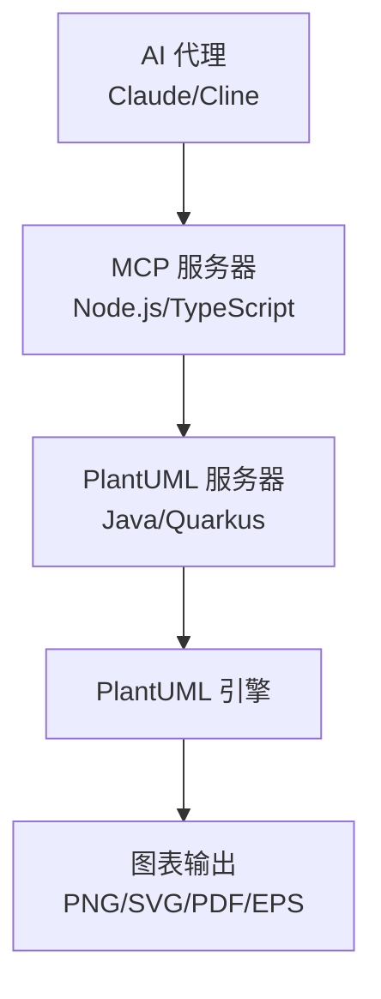

# PlantUML Server v1.0.0


🚀 **Production-Ready PlantUML Solution** - 集成Web服务器和AI助手支持的完整解决方案

一个基于 Quarkus 的高性能 PlantUML Web 服务器，提供 PlantUML 代码转换为图片的 RESTful API。包含 Model Context Protocol (MCP) 服务器，支持 AI 助手集成。支持多种输出格式，具有现代化的 Web 界面和完整的 Docker 化部署方案。

> **🚀 [快速开始](QUICKSTART.md)** | **📦 [Docker Hub](https://hub.docker.com/r/lihongjie0209/plantuml-server)** | **🛠️ [开发文档](#-开发指南)**

## ✨ 特性亮点

### 🌐 Web 服务器特性
- 🚀 **高性能**: 基于 Quarkus 框架，启动时间 < 1秒
- 🎨 **多格式支持**: PNG, SVG, PDF, EPS 等多种输出格式
- 🌐 **现代化界面**: 响应式 Web 界面，支持实时预览
- 📦 **容器化**: 完整的 Docker 支持，镜像大小仅 292MB
- ⚡ **热重载**: 开发模式支持代码热重载
- 🔒 **安全**: 非 root 用户运行，内置健康检查
- 🌍 **跨平台**: 支持 Linux (amd64/arm64) 多架构部署

### 🤖 AI 集成特性 (MCP Server v0.3.2)
- 🔌 **MCP协议**: 完整的 Model Context Protocol 服务器实现
- 🛠️ **3个优化工具**: 图表生成、格式查询、健康检查
- 💾 **文件保存**: 自动创建目录并保存图表文件
- 🌤️ **云就绪**: 支持远程 PlantUML 服务器
- 📊 **带宽优化**: 文件保存模式自动排除 Base64 数据
- 🔧 **双重兼容**: 支持 camelCase 和 snake_case 参数命名
- 🎯 **AI友好**: 针对 AI 客户端优化的工具描述

## 🚀 快速开始

### 🐳 Web 服务器 - 使用 Docker (推荐)

```bash
# 拉取并运行
docker run -p 9090:9090 lihongjie0209/plantuml-server:latest

# 访问应用
open http://localhost:9090
```

### 🤖 MCP 服务器 - AI 集成

```bash
# 克隆仓库
git clone https://github.com/lihongjie0209/plantuml-server.git
cd plantuml-server/mcp

# 安装依赖并构建
npm install
npm run build

# 启动 MCP 服务器
node dist/index.js

# 或使用全局安装
npm link
plantuml-mcp-server --help
```

### 💻 本地开发

```bash
# 克隆仓库
git clone https://github.com/lihongjie0209/plantuml-server.git
cd plantuml-server

# 运行开发模式
./mvnw compile quarkus:dev
```

## 🔌 API 文档

### 生成图片 (Base64)
```http
POST /api/plantuml/generate
Content-Type: application/json

{
  "code": "@startuml\nAlice -> Bob: Hello\n@enduml",
  "format": "png"
}
```

**响应示例:**
```json
{
  "success": true,
  "message": "Image generated successfully",
  "format": "png",
  "base64Data": "iVBORw0KGgoAAAANSUhEUgAA..."
}
```

### 下载图片
```http
POST /api/plantuml/image/{format}
Content-Type: application/json

{
  "code": "@startuml\nAlice -> Bob: Hello\n@enduml"
}
```

支持的格式: `png`, `svg`, `pdf`, `eps`

### 健康检查
```http
GET /api/plantuml/health
```

### 支持的格式列表
```http
GET /api/plantuml/formats
```

## 🎯 使用场景

### 🤖 AI 驱动的图表生成

通过 MCP 协议，AI 代理可以无缝地生成各种 UML 图表：

#### 用例 1: 系统设计讨论
```
用户: "帮我设计一个用户认证系统的时序图"
AI: "我来为您生成一个用户认证系统的时序图..."

[AI 使用 MCP 工具 plantuml-generate]
→ 自动生成专业的时序图
→ 返回图片供用户查看和讨论
```

#### 用例 2: 代码架构可视化
```
用户: "请根据这段代码生成类图"
AI: "我将分析您的代码并生成相应的类图..."

[AI 分析代码结构]
→ 生成 PlantUML 代码
→ 通过 MCP 调用图表生成
→ 输出标准的 UML 类图
```

#### 用例 3: 文档自动生成
```
开发团队通过 AI 代理：
1. 分析项目结构
2. 自动生成架构图
3. 创建 API 流程图
4. 输出项目文档

全程无需手动编写 PlantUML 代码
```

### � 集成开发工作流

#### VS Code + Cline 扩展
```javascript
// 1. 配置 Cline MCP 集成
{
  "mcp": {
    "plantuml": {
      "command": "plantuml-mcp-server",
      "args": ["--server-url", "http://localhost:9090"]
    }
  }
}

// 2. 在开发过程中使用
// 用户在 VS Code 中与 Cline 对话：
// "帮我为这个函数生成流程图"
// Cline 自动调用 PlantUML 生成图表
```

#### Claude Desktop 集成
```json
// claude_desktop_config.json
{
  "mcpServers": {
    "plantuml": {
      "command": "plantuml-mcp-server",
      "args": ["--server-url", "http://localhost:9090"]
    }
  }
}

// 使用体验：
// 1. 启动 PlantUML 服务器
// 2. 打开 Claude Desktop
// 3. 直接对话："生成一个微服务架构图"
// 4. Claude 自动生成专业图表
```

### 🏢 企业级部署

#### 内网部署方案
```yaml
# 企业内网 docker-compose.yml
version: '3.8'
services:
  plantuml-cluster:
    image: lihongjie0209/plantuml-server:latest
    deploy:
      replicas: 3
    ports:
      - "9090-9092:9090"
    
  nginx-lb:
    image: nginx:alpine
    ports:
      - "80:80"
    volumes:
      - ./nginx.conf:/etc/nginx/nginx.conf
    depends_on:
      - plantuml-cluster

  mcp-gateway:
    build: ./mcp
    environment:
      - PLANTUML_SERVER_URL=http://nginx-lb
    ports:
      - "3000:3000"
```

#### 多团队共享
```bash
# 不同团队的 AI 代理都连接到同一个服务
Team A: Claude Desktop → MCP → PlantUML 服务器
Team B: Cline Extension → MCP → PlantUML 服务器  
Team C: Custom AI Tool → MCP → PlantUML 服务器

# 统一的图表生成服务，支持多种 AI 客户端
```

### 📊 性能测试场景

```bash
# 并发测试
for i in {1..100}; do
  curl -X POST localhost:9090/api/plantuml/generate \
    -H "Content-Type: application/json" \
    -d '{"code":"@startuml\nA->B\n@enduml","format":"png"}' &
done

# MCP 协议测试
cd mcp
npm run test:all  # 验证所有 MCP 工具功能

# 负载测试
ab -n 1000 -c 10 -p test-data.json \
   -T "application/json" \
   http://localhost:9090/api/plantuml/generate
```

## 📝 使用示例

### curl 示例
```bash
# 生成 PNG 图片
curl -X POST http://localhost:9090/api/plantuml/generate \
  -H "Content-Type: application/json" \
  -d '{
    "code": "@startuml\nAlice -> Bob: Hello\nBob -> Alice: Hi\n@enduml",
    "format": "png"
  }'

# 下载 SVG 文件
curl -X POST http://localhost:9090/api/plantuml/image/svg \
  -H "Content-Type: application/json" \
  -d '{
    "code": "@startuml\nAlice -> Bob: Hello\n@enduml"
  }' \
  -o diagram.svg
```

### JavaScript 示例
```javascript
async function generateDiagram() {
  const response = await fetch('/api/plantuml/generate', {
    method: 'POST',
    headers: { 'Content-Type': 'application/json' },
    body: JSON.stringify({
      code: '@startuml\nAlice -> Bob: Hello\n@enduml',
      format: 'png'
    })
  });
  
  const result = await response.json();
  if (result.success) {
    const img = document.createElement('img');
    img.src = `data:image/png;base64,${result.base64Data}`;
    document.body.appendChild(img);
  }
}
```

## 🐳 Docker 部署

### 🚀 一键启动 (推荐)

#### Linux/macOS
```bash
# 开发环境
./deploy.sh start dev

# 生产环境
./deploy.sh start prod

# 查看日志
./deploy.sh logs

# 停止服务
./deploy.sh stop
```

#### Windows
```powershell
# 开发环境
.\deploy.ps1 start dev

# 生产环境
.\deploy.ps1 start prod

# 查看日志
.\deploy.ps1 logs

# 停止服务
.\deploy.ps1 stop
```

### 📋 完整 Docker Compose 配置

#### 开发环境
```yaml
version: '3.8'
services:
  plantuml-server:
    image: lihongjie0209/plantuml-server:latest
    ports:
      - "9090:9090"
    environment:
      - JAVA_OPTS=-Xmx512m -Xms256m
    restart: unless-stopped
    networks:
      - plantuml-network

  mcp-server:
    build:
      context: ./mcp
      dockerfile: Dockerfile
    environment:
      - PLANTUML_SERVER_URL=http://plantuml-server:9090
      - NODE_ENV=development
    depends_on:
      plantuml-server:
        condition: service_healthy
    networks:
      - plantuml-network

networks:
  plantuml-network:
    driver: bridge
```

#### 生产环境
使用 `docker-compose.prod.yml` 配置，包含：
- 资源限制 (CPU/内存)
- 增强的健康检查
- 日志轮转配置
- 安全性加固

### 📦 单独部署 PlantUML 服务器

```bash
# 拉取并运行
docker run -d \
  --name plantuml-server \
  -p 9090:9090 \
  -e JAVA_OPTS="-Xmx512m -Xms256m" \
  --restart unless-stopped \
  lihongjie0209/plantuml-server:latest
```

### 🔧 构建自定义镜像
```bash
# 克隆仓库
git clone https://github.com/lihongjie0209/plantuml-server.git
cd plantuml-server

# 构建 PlantUML 服务器
docker build -t my-plantuml-server .

# 构建 MCP 服务器
cd mcp && npm install && npm run build && cd ..
docker build -t my-mcp-server ./mcp

# 使用自定义镜像启动
docker-compose up -d
```

## 🛠️ 本地开发

### 前提条件
- JDK 11+
- Maven 3.8+

### 开发模式
```bash
./mvnw compile quarkus:dev
```

### 运行测试
```bash
./mvnw test
```

### 生产构建
```bash
./mvnw package
java -jar target/quarkus-app/quarkus-run.jar
```

## ⚙️ 配置

### 环境变量
- `QUARKUS_HTTP_PORT`: 服务端口 (默认: 9090)
- `QUARKUS_HTTP_HOST`: 绑定地址 (默认: 0.0.0.0)
- `JAVA_OPTS`: JVM 参数

### application.properties
```properties
quarkus.http.port=9090
quarkus.http.cors=true
quarkus.http.limits.max-body-size=50M
```

## 🏗️ 项目架构

本项目采用微服务架构，包含两个核心组件：

### 📁 项目结构

```
plantuml-server/
├── src/main/java/                    # 主服务器 (Java/Quarkus)
│   ├── service/PlantUMLService.java      # 核心服务
│   ├── resource/PlantUMLResource.java    # REST 控制器
│   ├── dto/                              # 数据传输对象
│   └── PlantUMLApplication.java          # 应用主类
├── mcp/                              # MCP 服务器 (Node.js/TypeScript)
│   ├── src/
│   │   ├── index.ts                      # MCP 服务器主入口
│   │   ├── client.ts                     # PlantUML HTTP 客户端
│   │   ├── types.ts                      # 类型定义和验证
│   │   └── test-*.ts                     # 测试套件
│   ├── dist/                             # 编译输出
│   └── package.json                      # Node.js 配置
├── src/main/resources/
│   ├── application.properties            # 配置文件
│   └── META-INF/resources/index.html     # Web 界面
├── .github/workflows/                # CI/CD 配置
│   ├── docker-build-push.yml            # Docker 构建和发布
│   └── mcp-ci-cd.yml                     # MCP 服务器 CI/CD
├── docs/                             # 项目文档
├── Dockerfile                        # Docker 配置
├── docker-compose.yml                # 编排配置
└── pom.xml                          # Maven 配置
```

### 🔄 服务通信流程

```
┌─────────────────┐    ┌──────────────────┐    ┌─────────────────┐
│   AI 代理       │    │   MCP 服务器     │    │ PlantUML 服务器  │
│ (Claude/Cline)  │    │ (Node.js/TS)     │    │ (Java/Quarkus)   │
└─────────────────┘    └──────────────────┘    └─────────────────┘
         │                       │                       │
         │ 1. MCP Protocol       │                       │
         │◄─────────────────────►│                       │
         │                       │ 2. HTTP REST API     │
         │                       │◄─────────────────────►│
         │                       │                       │
         │ 3. 返回图表结果        │ 4. PlantUML 处理     │
         │◄─────────────────────▼│◄─────────────────────▼│
```

### 🚀 部署架构

#### 开发环境
```
localhost:9090  ← PlantUML 服务器 (Quarkus Dev Mode)
      ↑
MCP 服务器 (npm start) ← AI 客户端
```

#### 生产环境
```
Load Balancer
      ↓
┌─────────────┐  ┌─────────────┐  ┌─────────────┐
│PlantUML #1  │  │PlantUML #2  │  │PlantUML #3  │
│Port: 9090   │  │Port: 9091   │  │Port: 9092   │
└─────────────┘  └─────────────┘  └─────────────┘
      ↑               ↑               ↑
      └───────────────┼───────────────┘
                      ↓
              ┌─────────────┐
              │ MCP 服务器   │
              │集群部署      │
              └─────────────┘
                      ↑
              ┌─────────────┐
              │ AI 代理集群  │
              └─────────────┘
```

## 🛠️ 技术栈

### 主服务器 (PlantUML HTTP API)
- **框架**: [Quarkus](https://quarkus.io/) 3.3.3
- **语言**: Java 11+
- **图表引擎**: [PlantUML](https://plantuml.com/)
- **REST**: RESTEasy Reactive
- **JSON**: Jackson
- **构建**: Maven

### MCP 服务器 (AI 集成)
- **运行时**: Node.js 18+
- **语言**: TypeScript 5+
- **协议**: [Model Context Protocol](https://modelcontextprotocol.io/)
- **验证**: AJV (JSON Schema)
- **HTTP 客户端**: Axios
- **构建**: TypeScript Compiler

### 基础设施
- **容器**: Docker & Docker Compose
- **CI/CD**: GitHub Actions
- **注册表**: Docker Hub
- **架构**: Multi-arch (amd64/arm64)
- **监控**: 内置健康检查

### 支持的 AI 平台
- **Claude Desktop** - Anthropic 官方客户端
- **Cline** - VS Code 扩展
- **其他 MCP 兼容客户端** - 任何支持 MCP 协议的 AI 代理

## 🤖 MCP 服务器 (Model Context Protocol)

项目包含一个完整的 MCP 服务器，允许 AI 代理（如 Claude、Cline 等）通过标准化接口使用 PlantUML 功能。MCP 服务器与主服务器配合使用，提供无缝的 AI 集成体验。

### 🔄 两个项目如何配合工作



### 🚀 完整部署方案

#### 方案一：Docker Compose 一键部署 (推荐)

```yaml
# docker-compose.yml
version: '3.8'
services:
  plantuml-server:
    image: lihongjie0209/plantuml-server:latest
    ports:
      - "9090:9090"
    environment:
      - JAVA_OPTS=-Xmx512m -Xms256m
    restart: unless-stopped
    healthcheck:
      test: ["CMD", "curl", "-f", "http://localhost:9090/api/plantuml/health"]
      interval: 30s
      timeout: 10s
      retries: 3

  mcp-server:
    build: ./mcp
    depends_on:
      - plantuml-server
    environment:
      - PLANTUML_SERVER_URL=http://plantuml-server:9090
    restart: unless-stopped
```

```bash
# 启动完整服务栈
docker-compose up -d

# 验证服务状态
curl http://localhost:9090/api/plantuml/health
```

#### 方案二：本地开发环境

```bash
# 1. 启动 PlantUML 服务器
./mvnw compile quarkus:dev
# 服务运行在 http://localhost:9090

# 2. 启动 MCP 服务器
cd mcp
npm install && npm run build
npm start
# MCP 服务器连接到 localhost:9090
```

### 🔧 MCP 服务器配置

#### 快速设置

```bash
# 进入 MCP 目录
cd mcp

# 安装依赖
npm install

# 构建 TypeScript
npm run build

# 启动服务器（默认连接 localhost:9090）
npm start

# 使用自定义 PlantUML 服务器地址
PLANTUML_SERVER_URL=http://your-server:9090 npm start

# 或使用命令行参数
npm start -- --server-url http://your-server:9090
```

#### 配置选项

```bash
# 环境变量配置
export PLANTUML_SERVER_URL=http://localhost:9090
npm start

# 命令行参数配置
npm start -- --server-url http://localhost:9090 --help

# 查看版本信息
npm start -- --version
```

### 🤖 AI 客户端集成

#### Claude Desktop 配置

在 `claude_desktop_config.json` 中添加：

```json
{
  "mcpServers": {
    "plantuml": {
      "command": "node",
      "args": ["path/to/plantuml-server/mcp/dist/index.js"],
      "env": {
        "PLANTUML_SERVER_URL": "http://localhost:9090"
      }
    }
  }
}
```

#### Cline 扩展配置

在 Cline 的 MCP 设置中：

```json
{
  "server": {
    "command": "node",
    "args": ["./mcp/dist/index.js", "--server-url", "http://localhost:9090"]
  }
}
```

#### 全局安装方式

```bash
# 全局安装 MCP 服务器
cd mcp
npm install -g .

# 在任何地方使用
plantuml-mcp-server --server-url http://your-server:9090

# AI 客户端配置
{
  "mcpServers": {
    "plantuml": {
      "command": "plantuml-mcp-server",
      "args": ["--server-url", "http://localhost:9090"]
    }
  }
}
```

### 🛠️ MCP 工具功能

MCP 服务器提供以下工具供 AI 代理使用：

| 工具名称 | 功能描述 | 使用场景 |
|----------|----------|----------|
| `plantuml-generate` | 生成 PlantUML 图表 | 创建各种 UML 图表 |
| `plantuml-validate` | 验证 PlantUML 语法 | 检查代码语法正确性 |
| `plantuml-formats` | 获取支持的格式 | 查询可用的输出格式 |
| `plantuml-health` | 检查服务器健康状态 | 监控服务器可用性 |

#### 使用示例

```typescript
// AI 代理可以这样使用工具
{
  "tool": "plantuml-generate",
  "arguments": {
    "code": "@startuml\nAlice -> Bob: Hello\nBob -> Alice: Hi\n@enduml",
    "format": "png"
  }
}

// 返回结果
{
  "success": true,
  "format": "png",
  "data": "iVBORw0KGgoAAAANSUhEUgAA...",
  "message": "Diagram generated successfully in png format"
}
```

### 🔍 故障排除

#### 常见问题

1. **连接错误**
   ```bash
   # 检查 PlantUML 服务器状态
   curl http://localhost:9090/api/plantuml/health
   
   # 检查 MCP 服务器日志
   npm start -- --server-url http://localhost:9090
   ```

2. **权限错误**
   ```bash
   # 确保端口可访问
   netstat -tlnp | grep 9090
   
   # 检查防火墙设置
   sudo ufw status
   ```

3. **依赖问题**
   ```bash
   # 重新安装 MCP 依赖
   cd mcp
   rm -rf node_modules package-lock.json
   npm install
   npm run build
   ```

#### 调试模式

```bash
# 启用详细日志
DEBUG=* npm start

# 检查 MCP 协议通信
npm start -- --server-url http://localhost:9090 --debug
```

### 📊 性能优化

#### 生产环境配置

```bash
# 1. 优化 PlantUML 服务器
export JAVA_OPTS="-Xmx1g -Xms512m -XX:+UseG1GC"
./mvnw package
java $JAVA_OPTS -jar target/quarkus-app/quarkus-run.jar

# 2. 优化 MCP 服务器
export NODE_ENV=production
npm start -- --server-url http://localhost:9090
```

#### 负载均衡

```yaml
# nginx.conf
upstream plantuml_backend {
    server localhost:9090;
    server localhost:9091;
    server localhost:9092;
}

server {
    listen 80;
    location /api/plantuml/ {
        proxy_pass http://plantuml_backend;
        proxy_set_header Host $host;
        proxy_set_header X-Real-IP $remote_addr;
    }
}
```

### 🧪 测试验证

```bash
# 完整集成测试
cd mcp
npm run test:final

# 验证 API 端点
curl -X POST http://localhost:9090/api/plantuml/generate \
  -H "Content-Type: application/json" \
  -d '{"code": "@startuml\nAlice -> Bob\n@enduml", "format": "png"}'

# 测试 MCP 协议
echo '{"jsonrpc":"2.0","id":1,"method":"tools/list","params":{}}' | \
  node mcp/dist/index.js
```

**详细文档**: 📖 [MCP 服务器完整文档](mcp/README.md)

## 📊 性能指标

| 指标 | 数值 |
|------|------|
| 启动时间 | < 1秒 |
| 内存占用 | ~256MB |
| 响应时间 | < 100ms |
| 镜像大小 | 292MB |
| 架构支持 | amd64, arm64 |

## 🔧 部署到生产环境

### Kubernetes 部署
```yaml
apiVersion: apps/v1
kind: Deployment
metadata:
  name: plantuml-server
spec:
  replicas: 3
  selector:
    matchLabels:
      app: plantuml-server
  template:
    metadata:
      labels:
        app: plantuml-server
    spec:
      containers:
      - name: plantuml-server
        image: lihongjie0209/plantuml-server:latest
        ports:
        - containerPort: 9090
        livenessProbe:
          httpGet:
            path: /api/plantuml/health
            port: 9090
          initialDelaySeconds: 30
          periodSeconds: 10
---
apiVersion: v1
kind: Service
metadata:
  name: plantuml-server-service
spec:
  selector:
    app: plantuml-server
  ports:
  - port: 80
    targetPort: 9090
  type: LoadBalancer
```

## 🤝 贡献指南

1. Fork 本仓库
2. 创建功能分支: `git checkout -b feature/amazing-feature`
3. 提交更改: `git commit -m 'Add amazing feature'`
4. 推送分支: `git push origin feature/amazing-feature`
5. 创建 Pull Request

## 📄 许可证

本项目采用 MIT 许可证 - 详见 [LICENSE](LICENSE) 文件

## 🙏 致谢

- [PlantUML](https://plantuml.com/) - 强大的图表生成引擎
- [Quarkus](https://quarkus.io/) - 超音速亚原子 Java 框架
- [OpenJDK](https://openjdk.java.net/) - 开源 Java 平台

## 📈 项目状态


---

⭐ 如果这个项目对您有帮助，请给个 Star！

🔗 **项目链接**: https://github.com/lihongjie0209/plantuml-server
