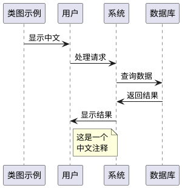

# 字体目录

这个目录用于存放 PlantUML 服务器需要的字体文件，特别是中文字体。

## 推荐的中文字体

请将以下字体文件放入此目录：

### 简体中文字体
- **Microsoft YaHei** (微软雅黑): `msyh.ttc`, `msyhbd.ttc`
- **SimSun** (宋体): `simsun.ttc`
- **SimHei** (黑体): `simhei.ttf`
- **KaiTi** (楷体): `simkai.ttf`

### 开源中文字体
- **Noto Sans CJK SC**: `NotoSansCJK-Regular.ttc`
- **Source Han Sans CN**: `SourceHanSansCN-Regular.otf`
- **WenQuanYi Micro Hei**: `wqy-microhei.ttc`

## 字体文件格式支持

- `.ttf` - TrueType 字体
- `.ttc` - TrueType 字体集合
- `.otf` - OpenType 字体

## 安装说明

1. 将字体文件复制到此目录
2. 重新构建 Docker 镜像：
   ```bash
   docker build -t plantuml-server:1.0.0 .
   ```
3. 字体将自动在容器中可用

## 注意事项

- 请确保你有使用这些字体的合法许可
- Microsoft 字体通常需要 Windows 许可证
- 建议使用开源字体以避免许可问题
- 字体文件通常较大，会增加 Docker 镜像大小

## PlantUML 中文支持

安装字体后，你可以在 PlantUML 图表中使用中文：


